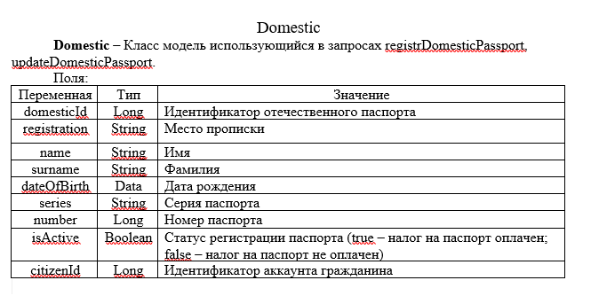

#Паспортный стол 
#1.     Описание 
При необходимости выполнения операций паспортного стола: использовать базовый функционал системы в рамках раздела "паспортный стол"
#2.     Выполнение 
  1.     Пользователь заходит под своим логином и паролем 
  2.     Переходит в раздел "паспортный стол"
  3.     В папортном столе доступны следущие операции
     -      регистрация отечественного паспорта    
     -      регистрация заграничного паспорта
     -      обновление отечественного паспорта
     -      обновление заграничного паспорта
          
#3.     Обзор
Ниже приведены снимки экранов системы
<Тута должны быть скрины фронта, но их нету  ¯\_(ツ)_/¯ >
Объектная модель паспортного стола описана в [ главе 5](#5)
#4.     Ограничения 
Система осуществляет следующие првоерки для вводимых параметров
     1.  (написать, как и когда выкидывает ошибку)
#5      Взаимодействие с API
     1.   Описание API
Domestic – Класс модель использующийся в запросах registrDomesticPassport, updateDomesticPassport. 

Поля:

  
